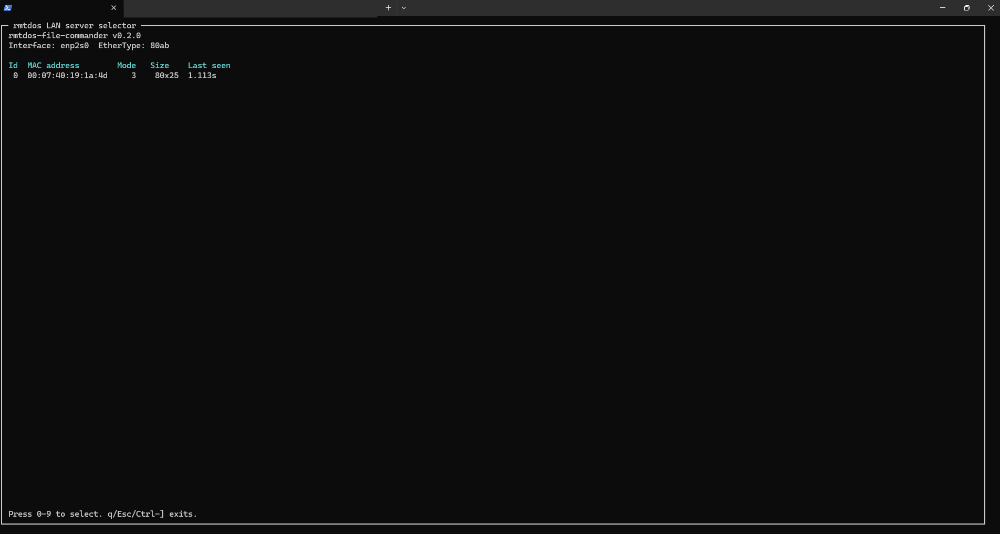
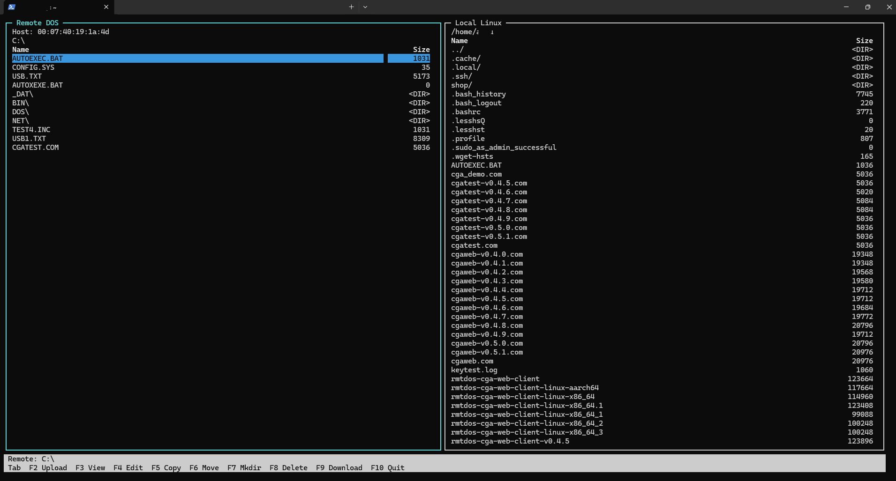

# rmtdos-file-commander

`rmtdos-file-commander` is a Midnight Commander / Norton Commander-style
ncurses file manager for Linux machines talking to a DOS host running the
`rmtdos-cga-web` TSR.

The DOS-side TSR is built and released by the companion
[`rmtdos-cga-web`](https://github.com/l00nix/rmtdos-cga-web) project. For full
remote directory and file-operation support, use `cgaweb.com` from
[`rmtdos-cga-web v0.5.1`](https://github.com/l00nix/rmtdos-cga-web/releases/tag/v0.5.1)
or newer.

It starts with the same rmtdos LAN host discovery flow as `rmtdos-cga-web-client`,
then opens a dual-pane file commander with remote DOS on the left and local Linux
on the right.





The current flow is:

1. Probe the LAN for rmtdos servers.
2. Select a DOS machine.
3. Open a dual-pane commander UI.
4. Treat the left pane as the remote DOS side.
5. Treat the right pane as the local Linux side.
6. Browse, copy, move, rename, create directories, delete, view, edit, upload,
   and download files through the rmtdos-cga-web protocol.

Remote directory browsing requires a `cgaweb.com` build that includes the
file-manager protocol extensions.

## Current Status

- LAN server selector: implemented.
- Dual-pane ncurses shell: implemented.
- Local Linux directory listing and navigation: implemented.
- Linux to DOS upload: implemented with existing `V1_FILE_PUT_*` packets.
- DOS to Linux download: implemented by prompting for a remote filename and using
  existing `V1_FILE_GET_*` packets.
- Remote DOS directory listing: implemented with the matching updated
  `cgaweb.com` TSR.
- Remote chdir/path handling: implemented client-side for directory browsing.
- Local copy, rename/move, mkdir, and delete: implemented.
- Remote copy, rename/move, mkdir, and delete: implemented with the matching
  updated `cgaweb.com` TSR.

## Build

Install ncurses development headers, then build on Linux:

```sh
make
```

The binary is written to:

```sh
out/rmtdos-file-commander
```

Like `rmtdos-cga-web-client`, the program uses raw Ethernet frames and normally
needs root or Linux capabilities:

```sh
sudo ./out/rmtdos-file-commander -i enp2s0
```

Optional EtherType override:

```sh
sudo ./out/rmtdos-file-commander -i enp2s0 -e 80ab
```

Show the build version:

```sh
./out/rmtdos-file-commander -v
```

## Keys

- `0`-`9`: select a DOS host from the startup selector.
- `Tab`: switch between remote and local pane focus.
- `Up` / `Down`: move selection in the focused pane.
- `Enter`: enter the selected directory or view the selected file.
- `F2`: upload the selected local file to the focused remote DOS directory.
- `v` / `F3`: view the selected local or remote file.
- `e` / `F4`: edit the selected local or remote file.
- `c` / `F5`: copy the selected file on the focused system. Local copy is
  implemented; remote copy requires the matching updated TSR.
- `n` / `F6`: rename/move the selected file or directory.
- `m` / `F7`: create a directory.
- `x` / `F8`: delete the selected file or empty directory after confirmation.
- `F9`: download the selected or prompted DOS filename into the current local
  directory.
- `u`: upload the selected local file to the focused remote DOS directory.
- `d`: download the selected or prompted DOS filename into the current local
  directory.
- `r`: refresh the focused directory listing.
- `F10`, `q`, `Esc`, `Ctrl-]`: quit.

Remote copy, rename/move, mkdir, and delete require a `cgaweb.com` build with
the matching file-operation protocol extension.

Viewing or editing a remote DOS file downloads it to a temporary local path.
Editing starts `$VISUAL`, `$EDITOR`, or `nano`, then asks whether to upload the
modified file back to DOS if the content changed. If you keep changes local only,
or if uploading fails, the temporary edited copy is preserved and its path is
printed before returning to the commander UI.

## Relationship to rmtdos-cga-web

This is a new standalone project, not a fork. It reuses the Linux-side raw
Ethernet, host discovery, and file-transfer protocol ideas from
[`rmtdos-cga-web`](https://github.com/l00nix/rmtdos-cga-web), and is licensed
GPL-2.0-or-later to remain compatible with that foundation.

See [docs/protocol-roadmap.md](docs/protocol-roadmap.md) for the proposed next
TSR protocol features.
